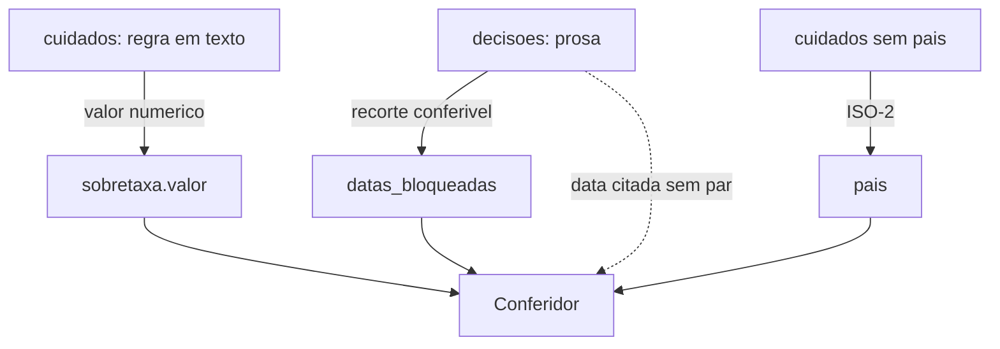
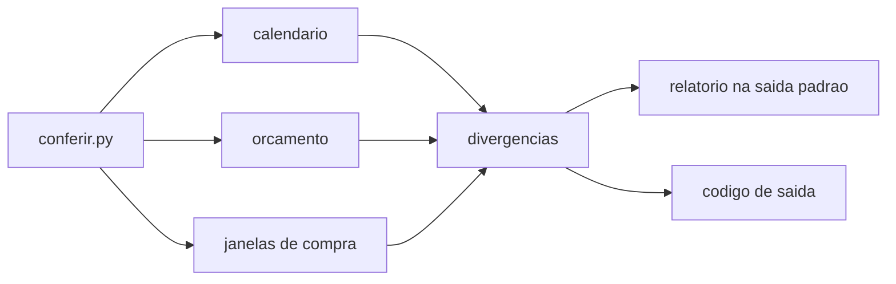
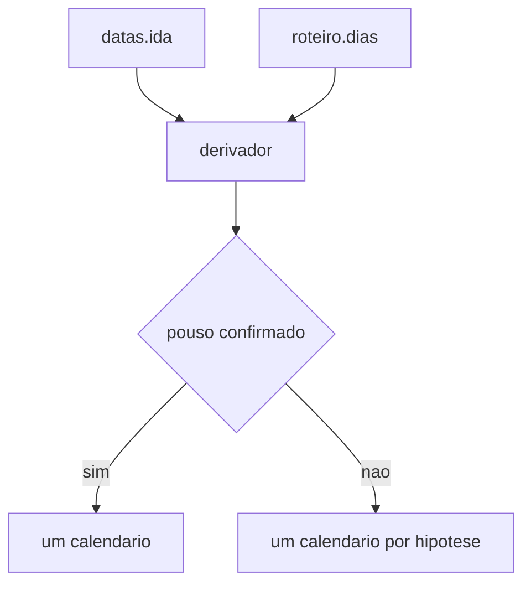
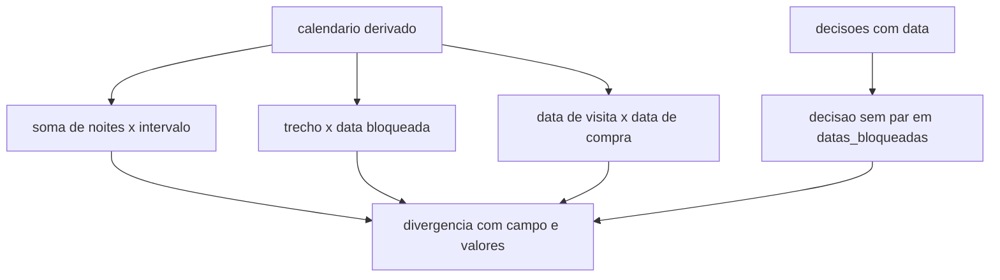
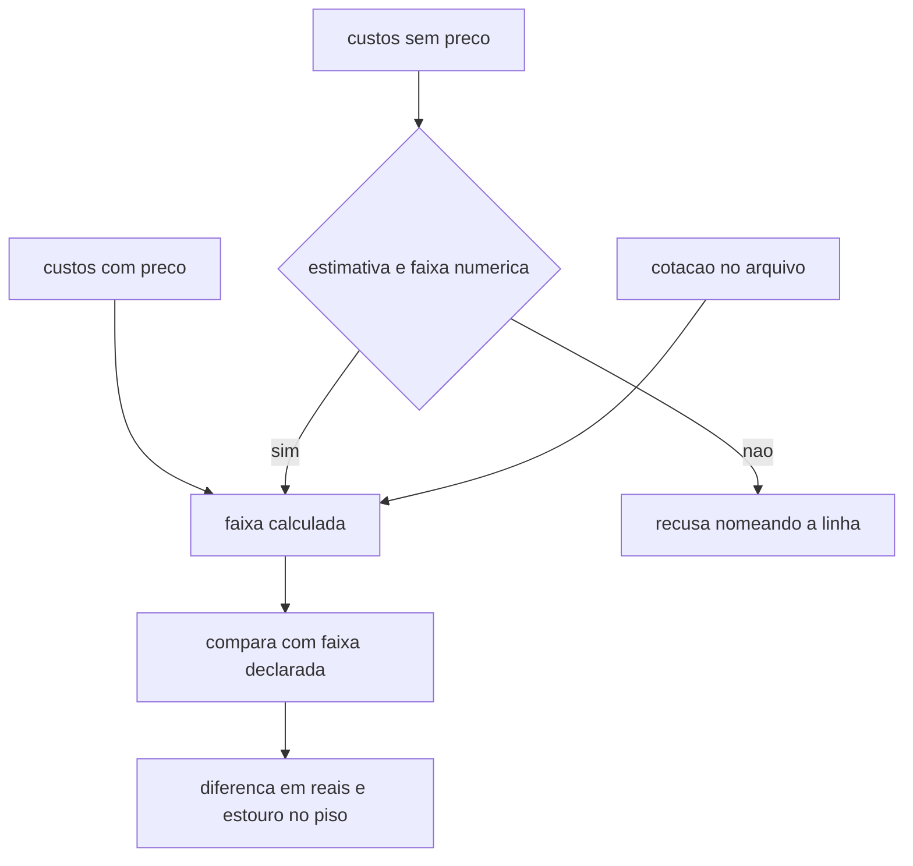
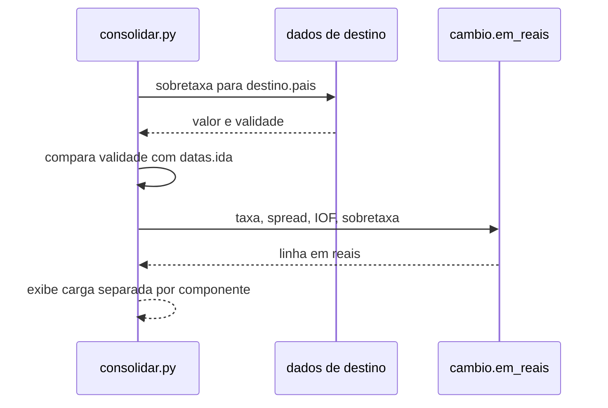
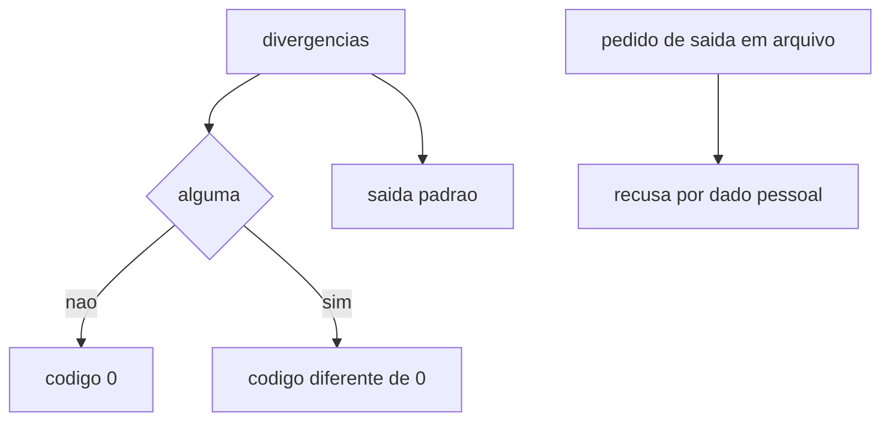
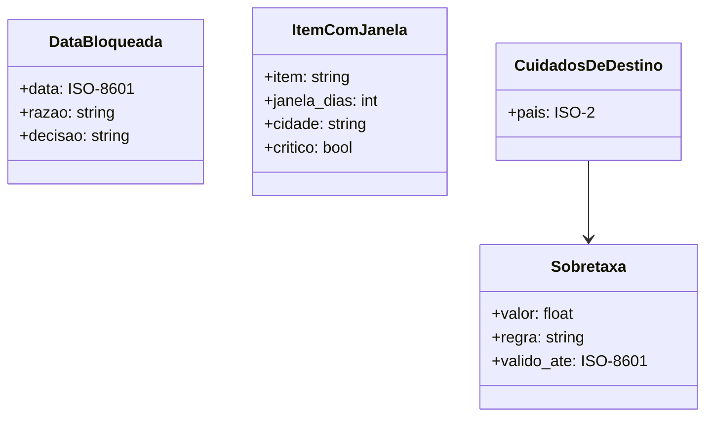

# Design Document

## Overview

A conferencia so consegue comparar dois blocos de um arquivo de viagem se os dois
estiverem em forma conferivel, e hoje nao estao. O arquivo da primeira viagem real guarda
as decisoes como prosa em `decisoes[]`, o roteiro em dias ordinais (`"dias": "2-8"`)
sem nenhuma data, e o `dados/china-cuidados.json` guarda a sobretaxa como a frase
`"3% sobre transacao internacional no app"`, sem campo de pais e sem numero. Foi
exatamente por serem prosa que duas decisoes nunca chegaram ao roteiro: nao
havia como nada alem de um leitor humano notar.

Por isso o desenho comeca por um contrato de dados (DES-1) e so depois pela
ferramenta. O conferidor nasce irmao do `saude.py`, na raiz: mesmo papel — varrer
um diretorio de dados do projeto, relatar e sair com codigo — e mesmo publico, que
e o hook e a CI. O `consolidar.py` continua na skill `viagem`, porque e ferramenta
de uso direto de quem planeja, nao um verificador.

Duas restricoes moldam o resto. A conferencia nao acessa a rede, entao a aritmetica
de faixa usa a cotacao ja registrada no arquivo de viagem e declara a idade dela em
vez de buscar uma nova. E a conferencia nao escreve: o arquivo de viagem e dado
pessoal, fora do git, e uma correcao automatica apagaria a razao registrada na
decisao, que e a parte que custou mais caro para levantar.

### Change Type

new-feature

### Design Goals

1. Converter em dado conferivel as tres informacoes que hoje so existem em prosa, sem criar uma segunda fonte de verdade ao lado da que ja existe.
2. Derivar o calendario dos campos que ja existem (`datas.ida` mais `roteiro[].dias`) em vez de duplicar datas ISO que sairiam de sincronia.
3. Manter a conferencia offline e sem escrita, para que ela falhe por inconsistencia e nunca por rede, e nunca destrua a procedencia de uma decisao.
4. Reaproveitar a aritmetica de custo que ja existe em `cambio.em_reais`, em vez de abrir uma terceira conta de cambio no projeto.

### References

- **REQ-1**: Noites do roteiro reconciliam com as datas da viagem
- **REQ-2**: Deslocamento nao cai em data que uma decisao bloqueou
- **REQ-3**: A faixa de orcamento vem das linhas de custo
- **REQ-4**: Sobretaxa de pagamento do destino entra no total
- **REQ-5**: Sobretaxa registrada nos dados chega ao arquivo de viagem
- **REQ-6**: Data de compra sai da data da visita
- **REQ-7**: O relatorio serve a hook e a integracao continua
- **REQ-8**: A conferencia nao altera o arquivo de viagem

## System Architecture

### DES-1: Contrato de dados conferivel

Tres acrescimos de campo, cada um substituindo uma leitura em prosa. No arquivo de
viagem, `datas_bloqueadas[]` passa a registrar data, razao e a decisao de origem, e
todo item com janela de compra ganha `janela_dias` e a cidade que o hospeda. Nos
dados de destino, o arquivo de cuidados ganha `pais` em ISO-2 e a sobretaxa ganha
`valor` numerico ao lado da frase que ja existe.

A prosa nao sai: `decisoes[]` continua sendo o registro do porque, e o campo novo e
o recorte conferivel dela. O conferidor cruza os dois e acusa quando uma decisao
menciona uma data que nao virou `datas_bloqueadas[]`.

_Implements: REQ-2.1_

### DES-2: O conferidor, irmao do saude.py

`conferir.py` na raiz do projeto, com a mesma anatomia do `saude.py`: uma funcao por
familia de checagem, cada uma devolvendo uma lista de divergencias, e um `main()`
que imprime e decide o codigo de saida. Recebe um caminho opcional; sem argumento,
varre `viagens/*.json`.

A escolha da raiz e deliberada. `saude.py` cuida de `dados/`, `conferir.py` cuida de
`viagens/`, e os dois servem hook e CI. `consolidar.py` fica onde esta, na skill
`viagem`, porque e ferramenta de uso direto de quem planeja.

_Implements: REQ-7.3, REQ-7.4, REQ-7.5, REQ-8.3_

### DES-3: Calendario derivado, nunca duplicado

As datas saem de `datas.ida` mais o numero do dia: dia 1 e a ida, dia N e
`ida + N - 1`. Nenhuma data ISO nova entra no roteiro — duplicar as datas criaria
dois campos dizendo a mesma coisa, e o defeito que esta mudanca corrige e
exatamente dois campos que discordaram.

`roteiro[].noites` e a fonte para contar; `roteiro[].dias` e texto para humano e
nao entra em conta nenhuma. A razao e empirica: no arquivo da viagem real nenhuma
convencao de intervalo fecha para os quatro blocos ao mesmo tempo. Com
`fim - inicio + 1`, tres blocos batem e o quarto da 5 contra as 4
declaradas. Escolher uma convencao faria o derivador silenciar justo a divergencia
que precisa acusar, entao `dias` e conferido contra `noites` e a discordancia vira
divergencia, em vez de virar regra.

A ambiguidade da chegada fica explicita em vez de resolvida no chute: enquanto a
passagem nao estiver comprada, a data de pouso admite mais de um valor, e o
conferidor deriva um calendario por hipotese.

_Implements: REQ-1.1, REQ-1.3, REQ-6.1_

### DES-4: Checagens de calendario

Tres comparacoes sobre o calendario derivado. A soma de `roteiro[].noites` contra o
numero de noites que o intervalo entre ida e volta comporta; cada trecho de
deslocamento contra `datas_bloqueadas[]`; e a data de visita de cada item com janela
de compra contra a data de compra que o arquivo declara.

Toda divergencia carrega o campo de origem e os dois valores em conflito, para que o
relatorio diga onde olhar e nao so que algo esta errado.

_Implements: REQ-1.2, REQ-1.4, REQ-1.5, REQ-2.2, REQ-2.3, REQ-2.4, REQ-2.5, REQ-6.2, REQ-6.3, REQ-6.4_

### DES-5: Faixa de orcamento a partir das linhas

A faixa sai de `custos[]`: linhas com preco entram pelo valor, linhas sem preco
entram pela faixa numerica declarada em `estimativa`, e a folga entra como qualquer
outra linha. O resultado e comparado com a faixa que o arquivo declara em prosa, e a
diferenca vai para o relatorio.

A recusa e por linha, nao pela faixa inteira. Linha em reais — a folga e as
estimativas, que ja vem em reais — entra sempre, porque nao depende de cotacao.
Linha em moeda estrangeira depende da cotacao registrada no arquivo: sem ela, a
linha fica de fora e e nomeada, e o relatorio diz quanto da faixa ficou coberto.
Estimativa que nao expressa minimo e maximo tambem sai nomeada. Chutar uma cotacao
ausente produziria uma faixa com cara de conta fechada, que e o defeito que
originou a mudanca; recusar a faixa inteira por causa de uma linha esconderia o
que ja da para saber.

_Implements: REQ-3.1, REQ-3.2, REQ-3.3, REQ-3.4, REQ-3.5, REQ-3.6, REQ-3.7, REQ-3.8, REQ-5.1, REQ-5.2_

### DES-6: Sobretaxa dentro do consolidador

A sobretaxa e do consolidador, nao do conferidor: quem aplica um custo ao total e
quem soma o total. `consolidar.py` passa a procurar, nos arquivos de `dados/`, um
registro cujo `pais` case com `destino.pais`, e aplica `sobretaxa.valor` as linhas em
moeda estrangeira, na mesma composicao multiplicativa de `cambio.em_reais`.

A validade entra na conta: sobretaxa ou isencao cuja data de fim seja anterior a
`datas.ida` e registrada como fora de alcance, com a data, em vez de aplicada em
silencio.

_Implements: REQ-4.1, REQ-4.2, REQ-4.3_

### DES-7: Relatorio, codigo de saida e somente leitura

O relatorio vai apenas para a saida padrao, agrupado por familia de checagem, com o
caminho de cada arquivo conferido. Sem divergencia, codigo zero; com divergencia,
diferente de zero, para servir a hook e CI como o `saude.py` ja serve.

Nao ha caminho de escrita no modulo: o conferidor abre arquivo apenas para leitura, e
um pedido de saida em arquivo e recusado, porque o relatorio carrega dado pessoal de
viagem que o `.gitignore` mantem fora do repositorio de proposito.

_Implements: REQ-7.1, REQ-7.2, REQ-8.1, REQ-8.2, REQ-8.4, REQ-8.5_

## Data Models

## Error Handling

| Condicao | Resposta | Recuperacao |
|-----------------|----------|----------|
| Arquivo de viagem ausente ou ilegivel | Registra o motivo e encerra diferente de zero | Corrigir o caminho ou o JSON |
| Nenhum arquivo de viagem no diretorio | Registra que nada foi conferido e encerra diferente de zero | Criar o arquivo ou apontar outro diretorio |
| `custos[]` vazio | Registra que nao ha custo a somar | Migrar o orcamento para `custos[]` |
| Estimativa sem minimo e maximo | Exclui a linha da faixa e a nomeia | Reescrever a estimativa como faixa numerica |
| Sem cotacao registrada no arquivo | Nao calcula a faixa em reais e diz por que | Registrar a cotacao usada e a data |
| Decisao cita data sem par em `datas_bloqueadas[]` | Registra que a decisao nao virou dado conferivel | Criar a entrada de data bloqueada |
| Pedido de relatorio em arquivo | Recusa e explica que o relatorio tem dado pessoal | Redirecionar a saida padrao |

## Impact Analysis

O `consolidar.py` muda de comportamento: o total passa a incluir sobretaxa de
destino quando houver, entao viagens ja consolidadas mudam de numero. Isso e o
efeito pretendido — o total de hoje esta abaixo do que se paga — mas precisa
aparecer no relatorio como componente separado, e nao diluido na carga.

O `viagens/_esquema.md` e o `viagens/exemplo-lisboa-2027-03.json` mudam junto com o
contrato de dados; o esquema ja instrui a corrigir o esquema em vez de contornar no
codigo que le.

### Testing Requirements

- Nenhum teste toca a rede: cotacao e sobretaxa entram por parametro ou por arquivo de dados, como a suite ja faz.
- Cada familia de checagem tem um caso que dispara e um contraprovado que fica calado, para que o teste falhe por bug e nao por ausencia de dado.
- As regras de recusa de DES-5 e DES-7 sao verificadas por mutacao, seguindo a pratica que a suite ja adota.
- O `test_viagem_real_tem_o_orcamento_dentro_de_custos` varre `viagens/*.json` e tolera ausencia, porque viagem real fica fora do git; as checagens novas seguem a mesma regra.

### Breaking Changes

`consolidar.py` passa a exigir que o arquivo de dados de destino declare `pais` para
aplicar a sobretaxa. Arquivos de cuidados sem `pais` seguem sendo lidos, e a
sobretaxa deles e reportada como nao aplicavel em vez de ignorada em silencio.

### Risk Assessment

O risco central e o contrato de dados de DES-1 virar trabalho manual em todo arquivo
de viagem existente. Hoje existe um so real mais o exemplo, entao o
custo e baixo agora e cresce depois — razao para fazer a mudanca antes da proxima
viagem, nao depois.

## Code Anatomy

### Coverage Declaration

Coverage: Representative

Esta secao nao e lista de conclusao. Todo item de `### Discovery Targets` precisa ser
executado na Fase 3 antes de `tasks.md` ser escrito.

### Required Touchpoints

| Caminho | Status | Evidencia | Proposito | Implementa |
|-----------|--------|----------|---------|------------|
| `conferir.py` | New | Proposto por DES-2 | Entrada da conferencia, varre `viagens/` e decide o codigo de saida | DES-2, DES-3, DES-4, DES-5, DES-7 |
| `.claude/skills/viagem/scripts/consolidar.py` | Existing | Lido nesta sessao | Aplica a sobretaxa de destino ao total | DES-6 |
| `viagens/_esquema.md` | Existing | Lido nesta sessao | Documenta `datas_bloqueadas[]` e `janela_dias` | DES-1 |
| `dados/china-cuidados.json` | Existing | Lido nesta sessao | Ganha `pais` e `sobretaxa.valor` | DES-1 |
| `tests/test_viagens.py` | Existing | Lido nesta sessao | Cobre as checagens novas e a sobretaxa | Todos |

### Known Impact Surface

| Caminho | Por que considerar |
|-----------|--------------------|
| arquivo da viagem real | Ganha `datas_bloqueadas[]` a partir das decisoes que travam datas; e dado pessoal, fora do git |
| `viagens/exemplo-lisboa-2027-03.json` | Exemplo publico; precisa continuar valido no esquema novo |
| `.claude/skills/cambio-br/scripts/cambio.py` | Dona da formula; a sobretaxa entra pela composicao dela, sem copia |
| `saude.py` | Referencia de anatomia e de contrato de codigo de saida |
| `.claude/skills/viagem/SKILL.md` | Passa a citar a conferencia no fluxo |

### Discovery Targets

1. Levantar todo item de `falta_organizar.reservar_com_antecedencia` que tem janela de compra, e confirmar se `janela_dias` cobre todos ou se ha janela expressa de outra forma.
2. Varrer `dados/*.json` atras de outras regras de custo por destino que hoje nao chegam ao total, para saber se DES-6 atende so a sobretaxa ou uma familia maior.
3. Confirmar como `roteiro[].dias` se comporta quando o bloco e um trecho de deslocamento (`"dias": "8"`) e nao um intervalo, para que a conferencia de `dias` contra `noites` nao acuse falso positivo em bloco que nao tem noite.
4. Confirmar que o exemplo de Lisboa nao muda de total com DES-6. A expectativa e que nao mude: o destino e PT e nao ha `dados/*-cuidados.json` para PT, entao nenhuma sobretaxa se aplica. Confirmar antes de escrever as tarefas, porque o total de R$ 25.696,81 e usado como regressao na suite.

### Out of Scope

- Corrigir o conteudo do arquivo da viagem real: a conferencia acusa, a correcao e decisao de quem planeja.
- Buscar cotacao na rede durante a conferencia.
- Interpretar prosa de `decisoes[]` alem de reconhecer datas citadas.
- Unificar `conferir.py` e `saude.py` num verificador so.

## Repository Context Evidence

| Fonte | Evidencia | Restricao aplicada |
|--------|----------|--------------------|
| `AGENTS.md`, `ARCHITECTURE.md`, `TESTING.md` | Ausentes no repositorio | Convencoes inferidas do codigo vizinho; preferir estrutura simples a abstracao nova |
| `README.md` | Lido nesta sessao | Preservar a divisao de papeis entre as cinco skills |
| `BACKLOG.md` | Lido nesta sessao | Achados registrados no item 3.1-a; seguir a doutrina de alarme com saida acionavel |
| `saude.py` | Lido nesta sessao | Anatomia do verificador: funcao por familia, lista de problemas, codigo de saida |
| `.claude/skills/viagem/scripts/consolidar.py` | Lido nesta sessao | Reusar `linha_em_brl` e a delegacao a `cambio.em_reais` |
| `.claude/skills/cambio-br/scripts/cambio.py` | Lido nesta sessao | Formula de conversao e uma so; sobretaxa entra na composicao existente |
| `viagens/_esquema.md` | Lido nesta sessao | Todo custo mora em `custos[]`; corrigir o esquema em vez de contornar no codigo |
| `tests/test_viagens.py` | Lido nesta sessao | Nenhum teste toca a rede; verificacao por mutacao |
| `.gitignore` | Lido nesta sessao | Arquivo de viagem e dado pessoal e fica fora do repositorio |
| contextual-stewardship:architecture | `sds stewardship retrieve architecture` devolveu 0 regras | Sem regra registrada; decisoes deste documento sao a primeira referencia |

## Traceability Matrix

| DES | Requisitos | Cobertura |
|-----|------------|-----------|
| DES-1 | REQ-2.1 | Contrato de dados; viabiliza REQ-4.1, REQ-5.1 e REQ-6.1, que sao satisfeitos em DES-6, DES-5 e DES-3 |
| DES-2 | REQ-7.3, REQ-7.4, REQ-7.5, REQ-8.3 | Entrada e varredura |
| DES-3 | REQ-1.1, REQ-1.3, REQ-6.1 | Calendario derivado |
| DES-4 | REQ-1.2, REQ-1.4, REQ-1.5, REQ-2.2, REQ-2.3, REQ-2.4, REQ-2.5, REQ-6.2, REQ-6.3, REQ-6.4 | Checagens de calendario |
| DES-5 | REQ-3.1, REQ-3.2, REQ-3.3, REQ-3.4, REQ-3.5, REQ-3.6, REQ-3.7, REQ-3.8, REQ-5.1, REQ-5.2 | Faixa de orcamento |
| DES-6 | REQ-4.1, REQ-4.2, REQ-4.3 | Sobretaxa no total |
| DES-7 | REQ-7.1, REQ-7.2, REQ-8.1, REQ-8.2, REQ-8.4, REQ-8.5 | Relatorio e somente leitura |
